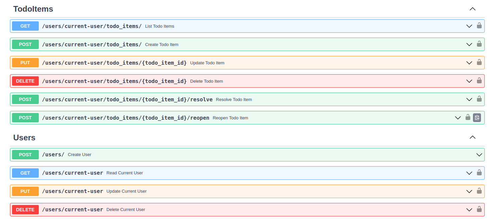
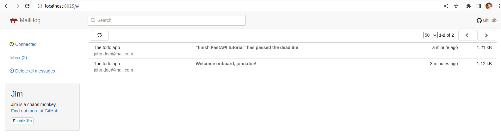
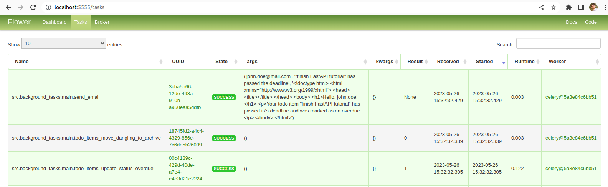

# fastapi-todo-rest


REST API backend boilerplate built with Python, FastAPI, and Celery. Inspired by [tiangolo/full-stack-fastapi-postgresql](https://github.com/tiangolo/full-stack-fastapi-postgresql) and [testdrivenio/fastapi-react](https://github.com/testdrivenio/fastapi-react).

The project is intended to be used as a template or a reference for creating new web services. The most interesting part is the tools and technologies that this project use. See the Features section below.

From the perspective of functional requirements the application is quite simple and offers the next functionality:
- register a user and send him a welcome e-mail in background, update profile, delete profile
- login a user
- create a todo item providing subject and optional deadline, delete a todo item
- edit a todo item by changing subject, deadline or visibility (e.g. move to archive)
- resolve/reopen a todo item
- periodically check for todo items that passed the deadline and mark them as overdue with e-mail notification
- periodically check for todo items that were resolved or overdue more than 24h ago and archive them

## Tools and technologies used

- Docker and Docker Compose
  - using healthchecks as readiness checks
  - reusing services definitions in Compose via `extends`
- [vscode Dev Containers](https://code.visualstudio.com/docs/devcontainers/containers) for the best developer experience
- GitHub Actions to run linters and tests on a pull-request
- git pre-commit hook that runs linters
- Python, Poetry
- FastAPI, Pydantic
- built-in OpenAPI (Swagger) Specification
  - "Try it out" button - easy to use playground with provided request payload examples
  - integrated OAuth2 authorization for trying endpoints that require authorization
- OAuth2 token authentication
- PostgreSQL and SQLAlchemy
  - alembic migrations
  - models with `create_time` and `update_time` timestamps that are being set automatically
  - using partial indices for the best performance and the smallest overhead
- Celery
  - scheduling background tasks directly from an API path operation's code
  - running periodic background tasks with a certain schedule
  - backed by RabbitMQ
  - using [Flower](https://github.com/mher/flower) to be able to monitor Celery tasks
- Pytest
  - tests are run against a separate isolated test DB
  - initial DB state is declared in a database seeding script
  - test data with either specific or faked (with Faker) fields is being created using factories
- linters and static analysis tools
  - [black](https://pypi.org/project/black/) for the code style checks
  - [isort](https://pycqa.github.io/isort/) for the imports order check
  - [Flake8](https://flake8.pycqa.org/en/latest/) for errors, unused code, code style, and cyclomatic complexity checks
  - [mypy](https://www.mypy-lang.org/) to do the type checking
- code autoformatting and cleaning
  - [autoflake](https://pypi.org/project/autoflake/) to remove unused imports and unused variables
  - [black](https://pypi.org/project/black/) to autoformat the code to conform to the PEP 8
  - [isort](https://pycqa.github.io/isort/) to sort imports
- [MailHog](https://github.com/mailhog/MailHog) for e-mails testing


## Prerequisites (dependencies)

- Docker ^23.0
- Docker Compose plugin ^2.17


## Before you start

> ⚠️ Make sure you've created a `.env` file from the `.env.example` template:
> ```sh
> cp .env.example .env
> ```
> and reviewed variables values in the `.env` file replacing `_CHANGE_THIS_` placeholders with appropriate values.


## How to start in vscode

The project was mainly configured to be developed in vscode. It is still available to be run simply with a CLI command without the vscode (see below).

The vscode's Dev Containers feature is used in order to reach a full integration of the IDE with the application's dockerized Python environment. That gives a decent developer experience (DX) working with the application's source code: code completion, code navigation etc.

In order to start the application and run vscode inside the application's container do the following:

1. in vscode open the project's directory
2. hit Ctrl+Shift+P
3. paste `remote-containers.reopenInContainer`
4. hit Enter

After application starts apply database migrations to initialize the database:
```
alembic upgrade head
```


## How to start without vscode

If you simply want to spin up the application or if the vscode is not an option for you, just run:
```
docker compose up --detach --build --wait
```

After application starts apply database migrations to initialize the database:
```
docker compose exec api alembic upgrade head
```


## OpenAPI docs

Out of the box FastAPI provides autogeneration of an OpenAPI documentation for your REST API.

Navigate to http://localhost:8000/docs.




## MailHog web UI

[MailHog](https://github.com/mailhog/MailHog) is an email testing tool for developers. It mimics sending a real email and allows you to see sent emails in your browser.

Navigate to http://localhost:8025/.



## Flower web UI

[Flower](https://github.com/mher/flower) is a web based tool for monitoring and administrating Celery clusters. Intended to be used in the project to debug Celery tasks.

Navigate to http://localhost:5555/. Protected with basic HTTP authentication. User and password are being set via `FLOWER_USER` and `FLOWER_PASSWORD` environment variables in the `.env` file.




## Day-to-day tasks cheat sheet

Navigate to [`application/README.md`](./application/README.md) to see frequently used commands cheat sheet.
